# Sandpainter

A falling-sand painting toy. Four spigots pour from the top, and you paint into the
mix: sand, water, oil, lava, ice, plants, acid, explosives and more. 26 elements to
paint, 9 more they turn into, and they all react with each other.

A from-scratch remake of Artsology's Sandpainting Game v2. **[See screenshots](#screenshots).**

## Play it

You don't need to install anything.

1. Open the [**Releases** page](https://github.com/pingywon/sandpainter/releases/latest)
   and download **`Sandpainter-v1.1.0.zip`** (under "Assets").
2. Unzip it.
   - **Windows:** right-click the zip, choose **Extract All**, then **Extract**.
   - **Mac:** double-click the zip.
3. Open the new **Sandpainter** folder and double-click **`Sandpainter.html`**.

It opens in your web browser (Chrome, Edge, Firefox or Safari) and works without internet.

If you already have this repository on your computer, skip the zip: double-click
`Sandpainter.html` in the top folder.

**Your saves** (the three save slots and the auto-save) are kept inside the browser you
played in. If you open the game in a different browser, they won't be there.

## Learn the elements

Double-click **`Element-Guide.html`**, which is in the same folder. It covers what every
element does, who floats on whom, how fast things burn, how big each explosion is, and
recipes to try. You can also open it from the **?** button inside the game.

## Controls

| Do this | What happens |
|---|---|
| Click and drag | Paint the element you picked on the left |
| Right-click and drag, or Shift and drag | Erase |
| `Space` | Pause / play |
| `.` | Move forward one tick |
| `Ctrl` + `Z` | Undo the last stroke |
| `[` and `]` | Smaller / bigger brush |
| `-` and `+` | Slower / faster |
| `1` to `9` | Pick one of the first nine elements |
| `E` / `R` | Eraser / Random |
| `G` | Flip gravity |
| `C` twice | Clear everything |

**The four spigots** above the canvas pour on their own. Click a spigot's name to choose
what it pours, and its bars to set how hard. **OFF** stops it; click any bar to start it again.

The panel on the right also has a wind slider, three save slots and a **Download PNG**
button for a picture of your painting.

## Screenshots

Every picture below is the real game, set up with the same elements you can paint.

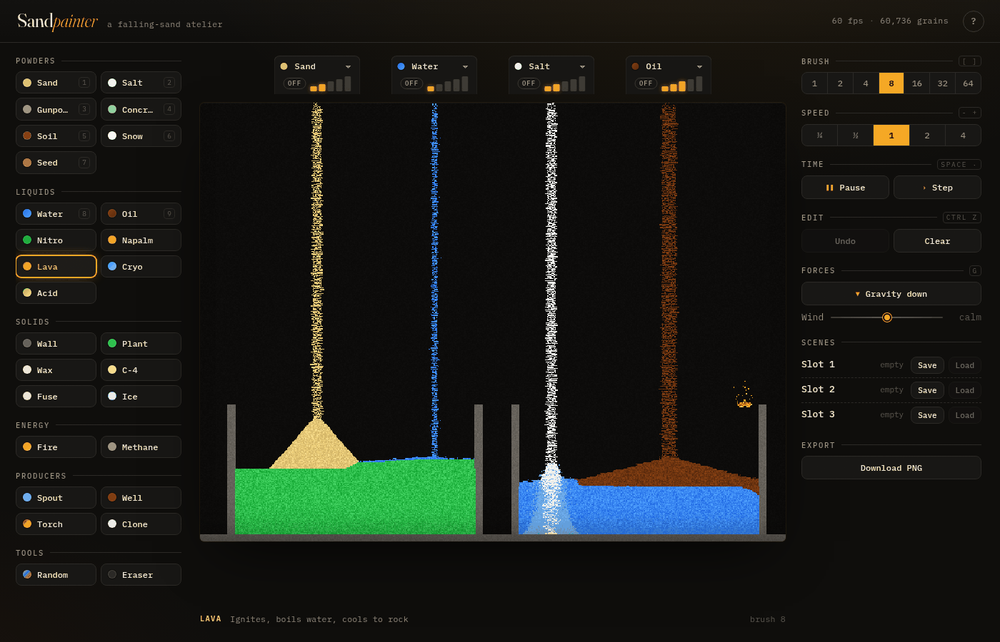

**The whole game.** Elements on the left, the four spigots along the top, controls on the
right. Here the spigots pour sand, water, salt and oil into two walled pools. On the left,
plants filled the pool up to just under the surface, but they don't climb the falling water.
On the right, oil floats on the water.

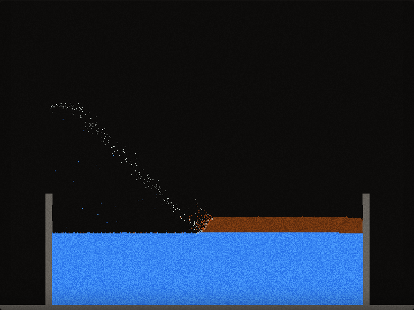

**Oil spill.** Oil floats on water. One spark at the left edge and the fire creeps across the
slick, one pixel at a time. Where flame reaches the water it dies in a puff of steam; the pale
trail rising behind the flames is that steam.

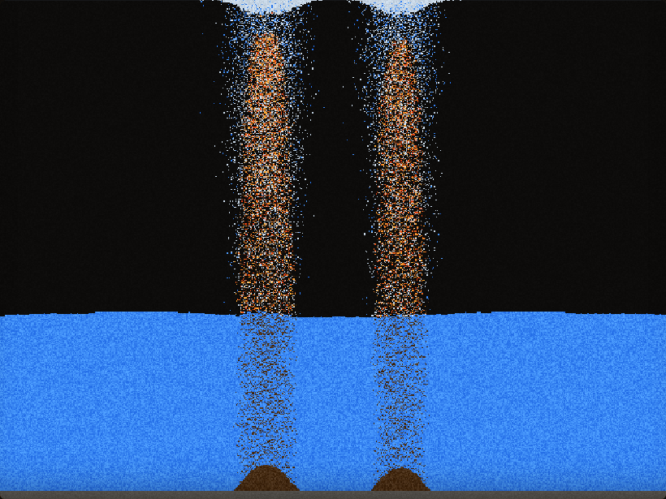

**Volcano.** Two spigots pour lava into a lake. Lava is the heaviest liquid, so it sinks, but
every drop that touches water cools into rock (the brown mounds) and boils the water into
steam, which rises to the top.

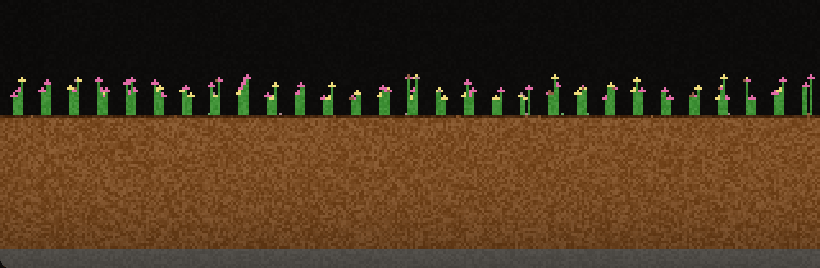

**Garden** (zoomed in 2×). A bed of soil, one line of water to soak it, then seeds dropped on
top. Each seed on wet soil grows a stem 6 to 14 pixels tall and opens a flower in one of
five colours. Seeds on dry soil do nothing.

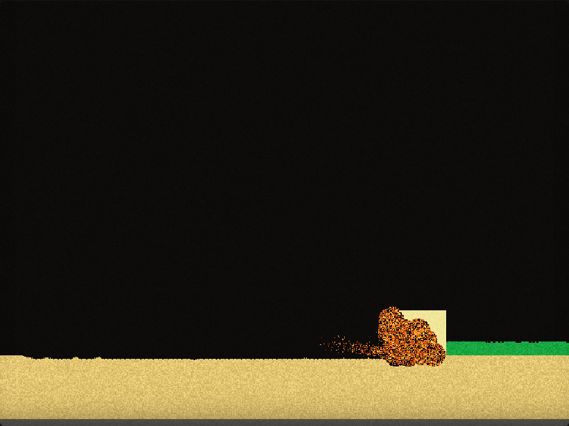

**Chain reaction.** One spark at the left end of a gunpowder trail. Each grain's pop sets off
the next, and about a second and a half later the chain reaches the block of C-4. Here it is
just going off: the biggest blast in the game.

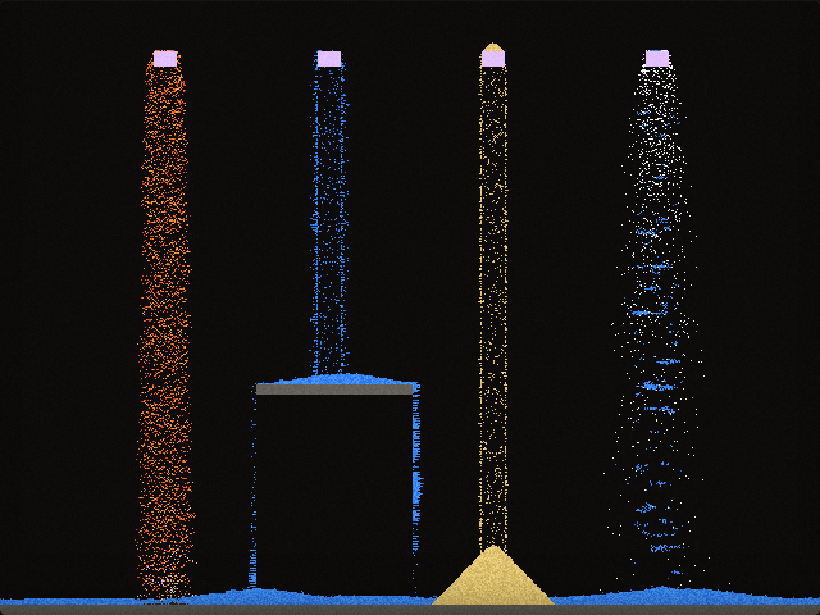

**Clone fountains.** Paint a clone block, then drop a little of something on top: the whole
block learns it and pours it out forever. Lava, water, sand and snow here. The water spills off the grey shelf, and where it
meets the lava on the floor, the two turn into rock.

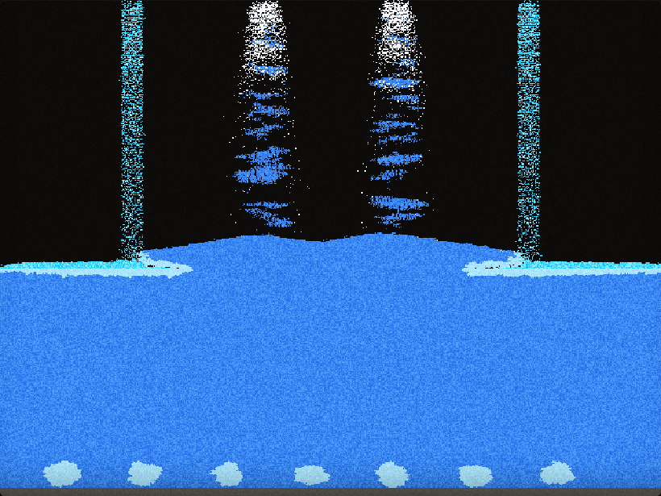

**Deep freeze.** Cryo pours from the outer spigots and freezes the surface into pale ice where
it lands. Snow from the middle spigots melts as soon as it hits the water. The blobs on the
bottom are ice, slowly freezing the lake from below.

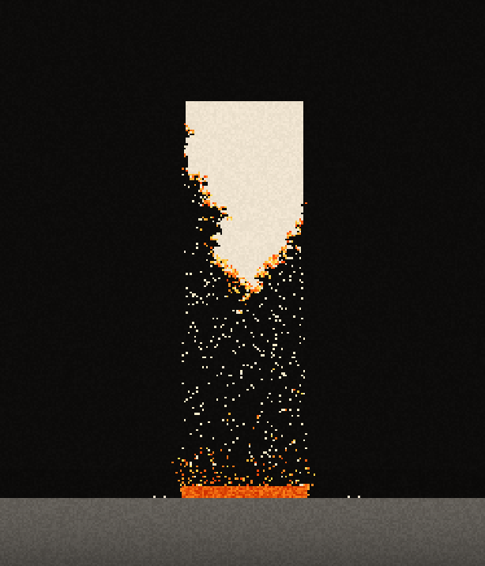

**Candle** (zoomed in 2×). A block of wax sitting on a torch. Wax never burns directly: it
melts, drips down as molten wax, and hardens again away from the heat, so the block is
eaten from the bottom up.

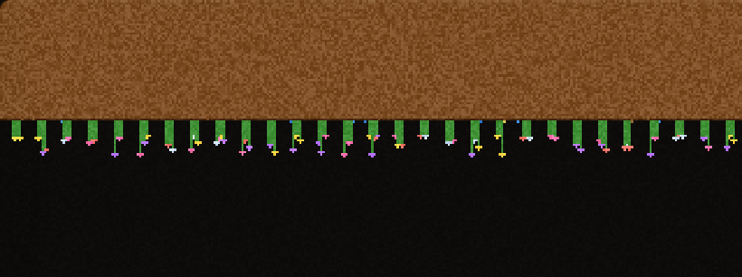

**Upside-down garden** (zoomed in 2×). Press `G` and gravity flips, so the soil falls to the
ceiling. Water it and drop seeds: they fall *up* onto it and grow downward, so the flowers
hang.

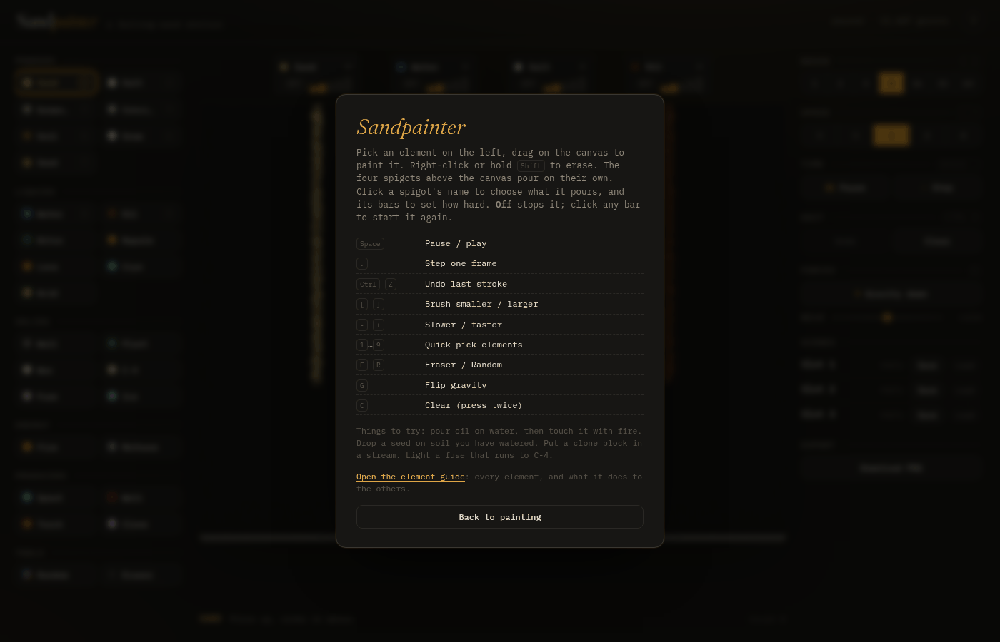

**Help.** Click **?** in the top-right corner for every key, how the spigots work, and a link
to the element guide.

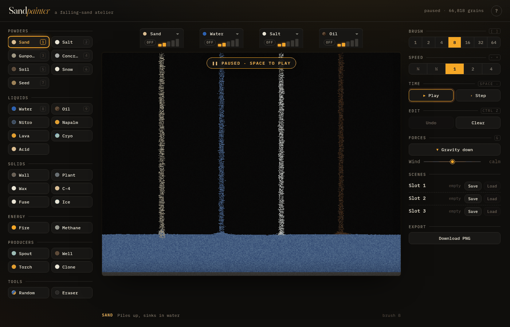

**Paused.** Press `Space` (or the Pause button) and the picture dims, with a **PAUSED** badge on
top. Press `Space` again, or click the badge, to carry on.

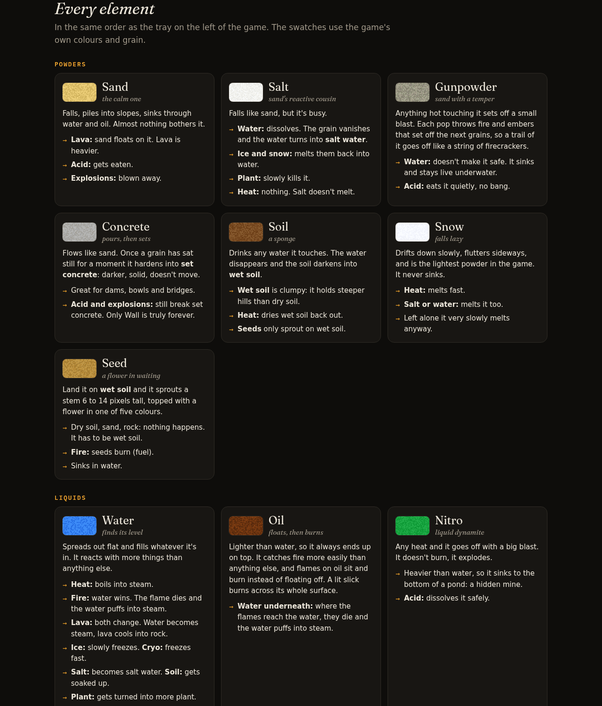

**The element guide.** `Element-Guide.html`, in the same folder as the game. It covers every
element, what it does to the others, and uses the game's real colours.

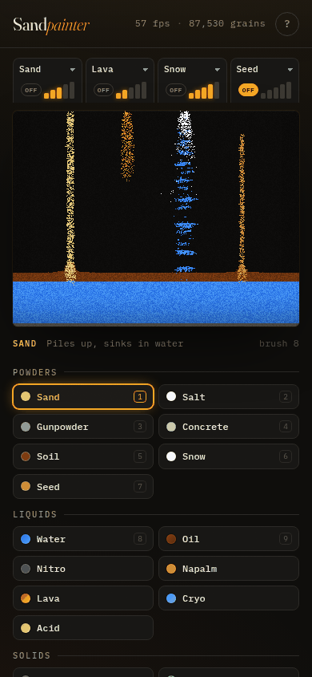

**On a phone.** The spigots line up in four columns, and the elements sit under the canvas.

## Changing the code

Everything above is for playing. This part is only for editing the game.

**Why there are two versions.** The source code lives in `src/` as separate JavaScript
files. Browsers refuse to load files like that from a page you double-clicked, so to run
the source version you need a tiny local web server. It doesn't do anything clever; it
only hands the files to the browser. `Sandpainter.html` is the same game with every file
merged into one, so it needs no server.

Run the source version:

```bash
python3 -m http.server 5173      # on Windows: python -m http.server 5173
```

then open http://localhost:5173/.

After changing anything in `src/`, `styles.css` or `index.html`, rebuild the one-file
version and commit it along with your change:

```bash
python3 tools/build_standalone.py
```

Check the element guide still matches the engine:

```bash
node tools/engine_checks.mjs
```

Retake the screenshots in `docs/screenshots/` (needs Chromium; Node 22+ can drop the flag):

```bash
node --experimental-websocket tools/screenshots.mjs          # all of them
node --experimental-websocket tools/screenshots.mjs 02 05    # just these
```

Make a release zip (it lands in `dist/`):

```bash
python3 tools/make_release.py 1.0.1
```

### What's where

```
Sandpainter.html         the one-file game (generated, do not edit by hand)
Element-Guide.html       the element guide (hand-written)
index.html               page markup for the source version
styles.css               the "dark atelier" look
src/main.js              start-up, frame loop, painting with the mouse, app API
src/engine/world.js      the grid of cells and the random number generator
src/engine/ids.js        element ids and property tables
src/engine/behaviors.js  shared rules: falling, flowing, rising, burning, exploding
src/engine/elements.js   every element: its colour, weight and what it does
src/engine/simulation.js one tick of the world
src/engine/spigots.js    the four pourers
src/engine/brush.js      painting
src/engine/history.js    undo
src/engine/storage.js    save slots and PNG pictures
src/render/renderer.js   drawing the grid to the screen
src/ui/*.js              the element tray, right-hand panel, spigot bar, keyboard keys
tools/                   build scripts, engine checks, screenshot maker, embedded fonts
docs/screenshots/        the pictures in this README
dist/sandpainter.html    the version published as a claude.ai artifact
```

### Adding an element

1. Add an id in `src/engine/ids.js`.
2. Add a `def(...)` in `src/engine/elements.js` with colour, flags, density and an
   `update` function built from the helpers in `behaviors.js`.
3. Put the id in `TRAY` (and `SPIGOT_OPTIONS` if spigots may pour it).
4. Add it to `Element-Guide.html`, then rebuild `Sandpainter.html`.

In the browser console, `window.sandpainter` is the app: `sandpainter.tick(100)` runs 100
ticks, `sandpainter.paint(x0, y0, x1, y1, id, size)` paints.

Fonts: Fraunces and IBM Plex Mono, under the SIL Open Font License 1.1 (`tools/fonts/`).
